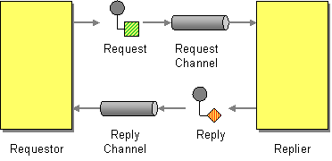
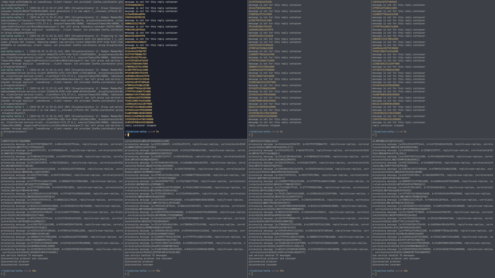

# Kafka Sum Service

This is a very trivial example of using [Kafka][kafka-website] to implement the
[request-reply pattern][eip-request-reply] using TypeScript and
[KafkaJS][kafkajs-website].



The [`ReplyContainer`](./src/reply-container.ts) is openly inspired from
[spring-kafka][spring-kafka-pr].

[eip-request-reply]:
  https://www.enterpriseintegrationpatterns.com/patterns/messaging/RequestReply.html
[kafka-website]: https://kafka.apache.org
[kafkajs-website]: https://kafka.js.org
[spring-kafka-pr]: https://github.com/spring-projects/spring-kafka/pull/544

## Prerequisites

- Docker and Docker Compose installed
- Node LTS

## Running it

First, we start Kafka and we create the two topics used for request-reply.

```sh
# pull and deploy a single Kafka broker
docker compose up -d

# [+] Running 2/2
#  ✔ Network sum-kafka_default    Created
#  ✔ Container sum-kafka-kafka-1  Started

# wait for Kafka to start
docker compose logs

# INFO [KafkaRaftServer nodeId=1] Kafka Server started (kafka.server.KafkaRaftServer)

# create the topics
./create-topics.sh

# Created topic sum-requests.
# Created topic sum-replies.
```

Then we can build and run the `sum-service` and an example `fibonacci`
application.

```sh
# install the dependencies
npm install

# lint and compile
npm run build

# start a sum service
node dist/sum-service.js

# in a separate shell, start a fibonacci application
node dist/fibonacci.js
```

Here's an example running 4 instances of `sum-service` and 3 instances of
`fibonacci`.


